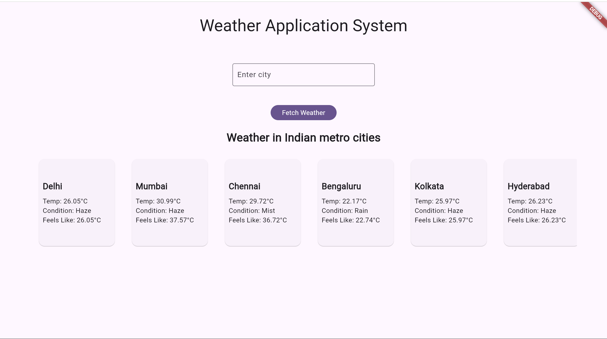

# Weather Monitoring System

A real-time weather data processing system that monitors conditions and provides summarized insights using data from the OpenWeatherMap API. The system features both historical data analysis and real-time weather alerts.


## Features

- Real-time weather monitoring
- Custom city search functionality
- Weather alerts and notifications
- Historical weather data analysis
- Interactive data visualizations
- MongoDB integration for data persistence
- Responsive Flutter-based frontend

## Screenshot demo


## Prerequisites

- Flutter SDK (latest stable version)
- Python 3.12 or higher
- MongoDB
- OpenWeatherMap API key

## Installation

### Frontend Setup

1. Install Flutter dependencies:
```bash
flutter pub get
```

2. Run the frontend application:
```bash
flutter run
```

The frontend will be accessible at `http://localhost:56686/`

### Backend Setup

1. Create a Python virtual environment:
```bash
pip install virtualenv
virtualenv -p 3.12 .venv
```

2. Activate the virtual environment:

For Linux/macOS:
```bash
source .venv/bin/activate
```

For Windows:
```bash
.venv\Scripts\activate
```

3. Install Python dependencies:
```bash
pip install -r requirements.txt
```

4. Create a `.env` file in the root directory with the following variables:
```env
MONGO_USER=your_mongodb_username
MONGO_PASS=your_mongodb_password
MONGO_HOST=your_mongodb_host
OPENWEATHERAPI=your_openweather_api_key
```

5. Start the Flask backend server:
```bash
python app.py
```

The backend will be accessible at `http://localhost:5000`

### OpenWeatherMap API Integration

The system uses the following OpenWeatherMap API endpoints:
- 5 Day / 3 Hour Forecast

## Contributing

1. Fork the repository
2. Create your feature branch 
3. Commit your changes
4. Push to the branch
5. Open a Pull Request

## License

This project is licensed under the MIT License - see the [LICENSE](LICENSE) file for details.

## Acknowledgments

- OpenWeatherMap API for providing weather data
- Flutter team for the excellent cross-platform framework
- MongoDB team for the robust database solution

## Contact
[@tanish105](https://github.com/tanish105)
